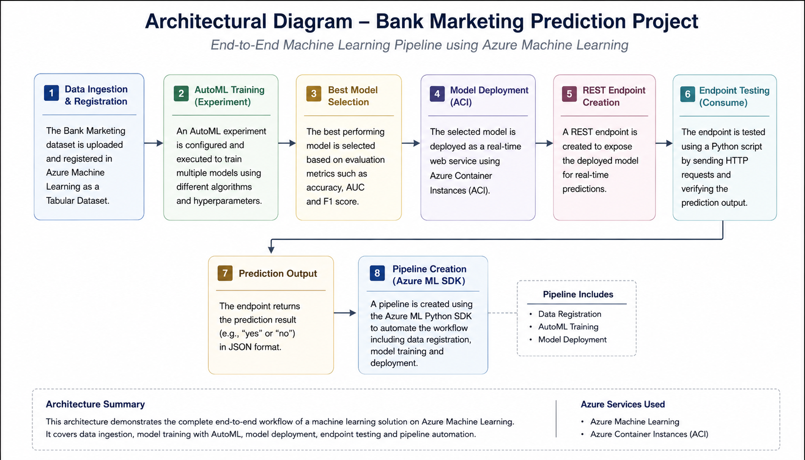
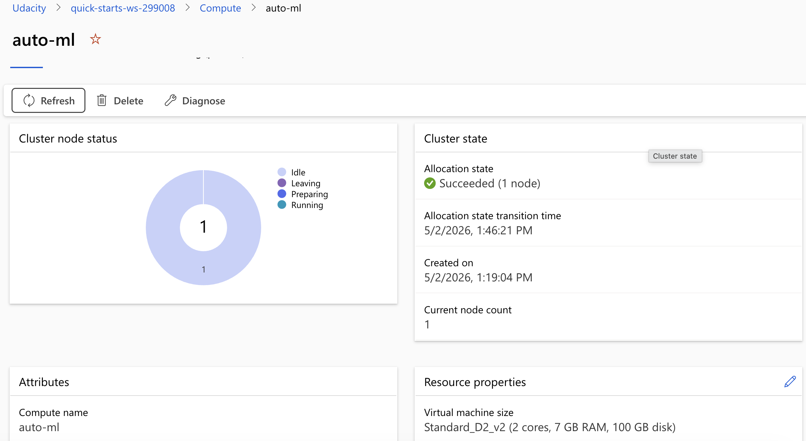
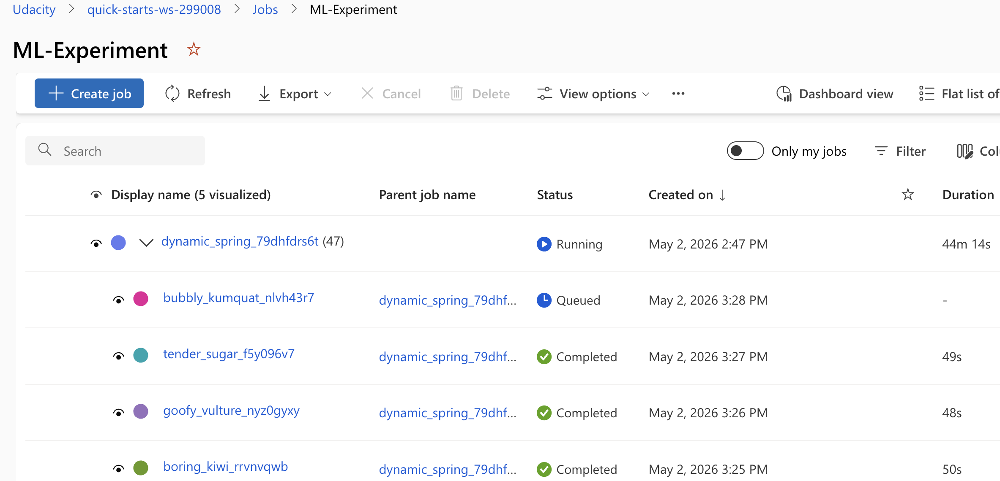
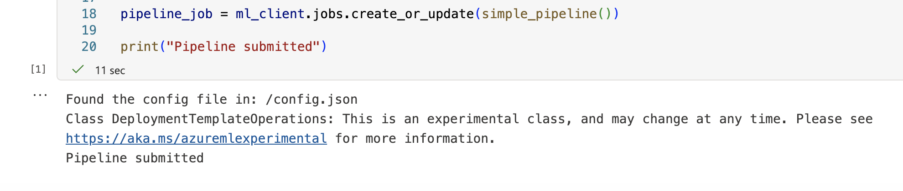
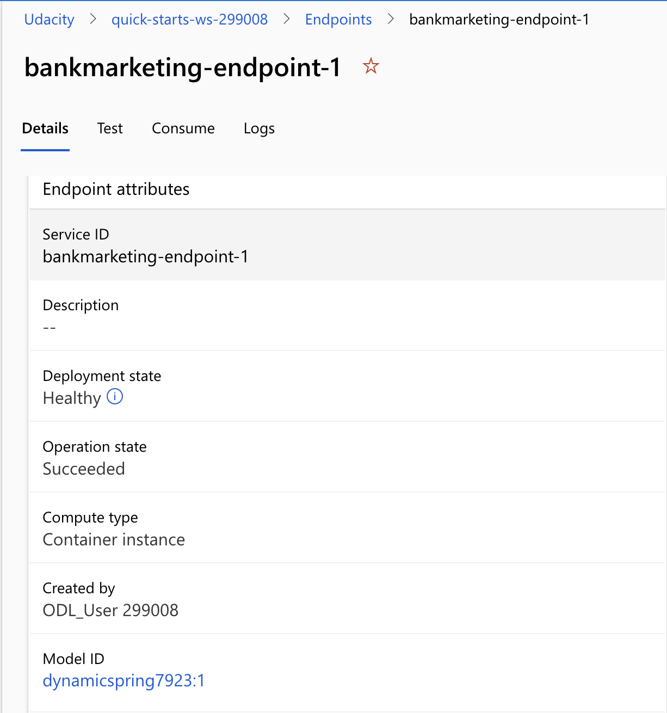
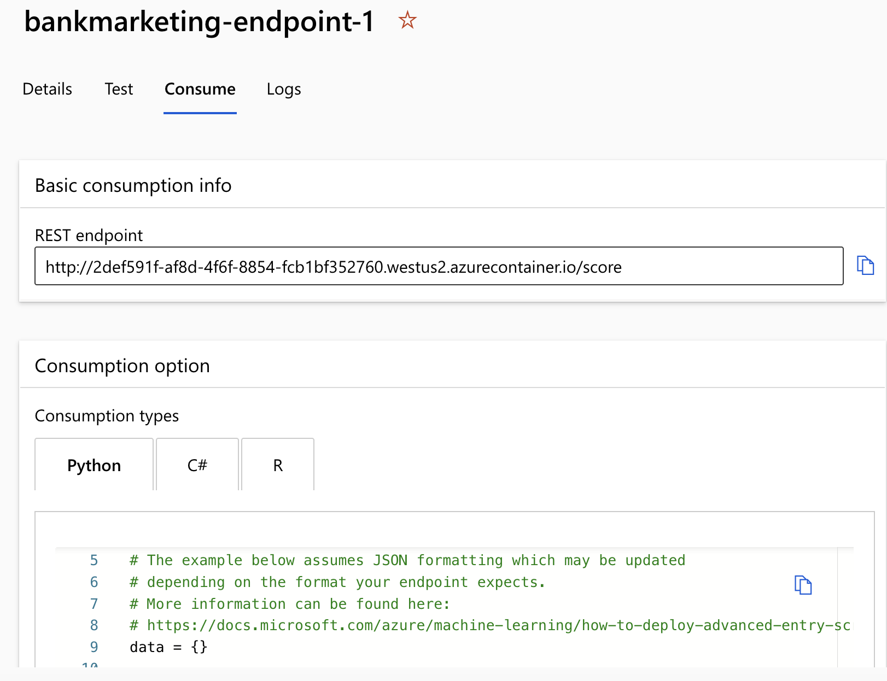
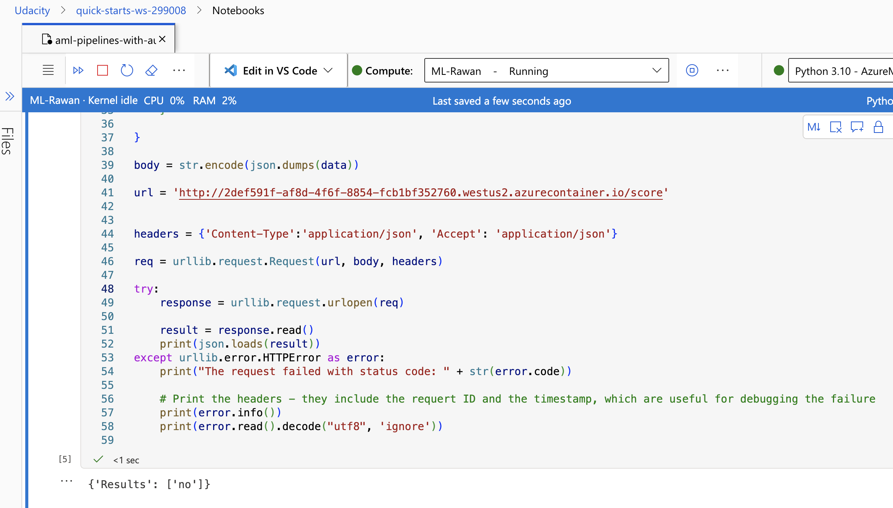
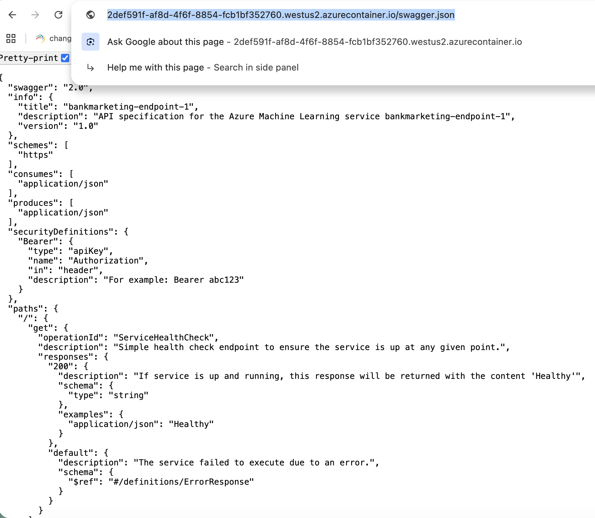

# Bank Marketing Prediction using Azure ML Pipeline

## Overview
This project demonstrates an end-to-end machine learning workflow using Azure Machine Learning. The objective is to predict whether a client will subscribe to a term deposit using the Bank Marketing dataset.

The project covers the full lifecycle of a machine learning solution, including data ingestion, model training using Automated ML (AutoML), pipeline creation, model deployment as a REST endpoint, and testing the deployed service.

---

## Architectural Diagram

  

This diagram represents the complete workflow of the project:

1. Data Ingestion & Registration  
   The dataset is uploaded and registered in Azure ML.

2. AutoML Training  
   Multiple models are trained automatically.

3. Best Model Selection  
   The best model is selected based on performance.

4. Model Deployment  
   The model is deployed using Azure Container Instances.

5. REST Endpoint Creation  
   A REST API is created.

6. Endpoint Testing  
   The endpoint is tested using HTTP requests.

---

## Key Steps

### 1. Dataset Exploration

  

---

### 2. Compute Cluster Setup

  

---

### 3. AutoML Experiment

  

---

### 4. Pipeline Creation

  

---

### 5. Model Deployment

  

---

### 6. Endpoint Consumption

  

---

### 7. Model Testing

  

---

### 8. Swagger Documentation

  

---

## Screen Recording

Add your video link here

---

## Standout Suggestions

- End-to-end ML pipeline implementation  
- AutoML for model selection  
- REST API deployment  
- Endpoint testing using Python  
